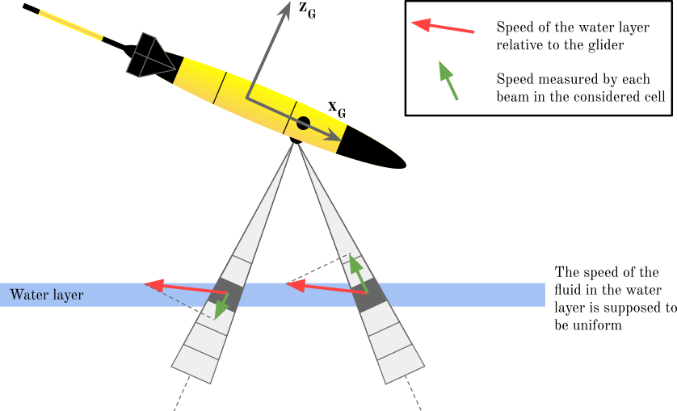

gliderad2cp: Processing ad2cp data from gliders
=================================================

``gliderad2cp`` gliderad2cp processes data from the Nortek AD2CP acoustic doppler current profiler (ADCP) mounted on a glider. gliderad2cp takes data from the ADCP unit and the glider and combines them to produce estimates of vertical shear of velocity. It also provides functionality to integrate these velocity shear profiles into absolute earth relative water velocities.

Code hosted at https://github.com/bastienqueste/gliderad2cp

Package description
=======================

gliderad2cp estimates absolute ocean currents from glider ADCP data in several steps, each of which can be run independently and controlled via a dictionary of settings. gliderad2cp has three primary modules, each of which have a convenience wrapper function and a number of sub-funcitons

1. ``process_shear`` Calculate vertical shear of velocities from ADCP and glider data

2. ``process_currents`` Integrate shear profiles into relative velocities, referencing these to dive averace current.

3. ``process_bias`` Correcting velocity profiles for along-beam shear bias

Input
----------

gliderad2cp requires two inputs:

1. A netCDF file from a Nortek AD2CP which can be produced using the Nortek MIDAS software

2. A timeseries of glider data. This timeseries can be read from a netCDF, csv, or parquet file, or passed in as an xarray DataSet or pandas Dataframe. The essential variables are:

- time
- pressure
- temperature
- salinity
- latitude
- longitude
- profile_number

Example datasets are prodived via the function ``download_example_data.load_sample_dataset``

A dictionary of processing options can be supplied. There are several options that can be customised including:

- QC correlation, amplitude and velocity thresholds
- Velocity regridding options
- Resolution of gridded output
- Offsets to correct for transducer misalignment

These are all set in the ``options`` dict returned by ``tools.get_options``. If no options are passed, default values are used.

Step 1. Process shear
----------------------

This is handled by the wrapper function ``process_shear.process((adcp_file_path, glider_file_path, options=None)``. The output of this function is a gridded xarray dataset including data from the AD2CP like ensemble correlation and return amplitude, as well as calculated glider relative velocities and profiles of eastward, northward, and vertical velocities SH_E, Sh_N and Sh_U.

``process_shear.process()`` executes the following functions in order

1. ``load_data`` - load data from a Nortek AD2CP netCDF file and a glider data file or dataset
2. ``_velocity_soundspeed_correction`` - Corrects along beam velocity data for lack of salinity measurements in ADCP default soundspeed settings.
3. ``_quality_control_velocities`` -  Removes bad velocity measurements based on velocity, amplitude and correlation criteria defined in options

The ADCP supplies observed relative velocities from an ensemble of pings. As well as the relative velocity, these ensembles
have the amplitude response and inter-ping correlation. These velocities, amplitudes and correlations are used to quality control the input data.
Using default settings, velocity estimates are discarded if they meet any of the following criteria:

- Velocity > 0.8 m/s

- Amplitude < 80 dB

- Correlation < 80 %

These settings can be changed using the ``options`` dictionary.

Additionally the first X bins can be discarded at this stage if the operator has observed side-lobe interference.

4. ``_determine_velocity_measurement_depths`` - Determines what depth each velocity measurement was taken at for each beam, account for glider attitude
5. ``_regrid_beam_velocities_to_isobars`` -  Regrids beam velocities onto isobars to avoid shear smearing in the final shear data

.. image::  ../../paper_figures/regridding.png

The Nortek AD2CP measurements are time-gated at the same intervals for each individual beam, meaning that the relation
between echo delay and measurement range is the same for all 4 beams and does not account for the more open front and
back beam angles. The purpose is to have 3 beams at equal angles from vertical when the glider is diving at the
correct angle (17.4 ° from horizontal for the Nortek AD2CP; in grey on the left). If the glider is flying at
a different angle, there will be a mismatch in depth between the 3 beams (in grey on the right) which requires regridding
and use of different bins (in green on the right) to minimise shear smearing.

6. ``_rotate_BEAMS_to_XYZ`` -  Coordinate transform that converts BEAM velocities to glider relative velocities X, Y, Z
7. ``_rotate_XYZ_to_ENU`` - Coordinate transform that converts velocity estimates relative to the glider (X, Y, Z) into the earth relative reference frame east, north, up (ENU)

Step 2. Process velocities
--------------------------

Prerequisite: Get pre and post dive GPS locations from glider data

To calculate dive average current we require more variables, including estimates of the glider's movement through the water. For this, we need the pre and post dive GPS locations of the glider. This calculation varies between glider models, processing tools and glider firmware versions. See the documentation for more examples of this calculation and make use of the verification plots. You can also provide your own input table of pre and post dive GPS locations and times.

An worked example is provided in the notebook, showing GPS location calculation from a 2024 SeaExplorer dataset. More examples can be found in the section :ref:`gps-calculations`.

Vertical shear of horizontal velocities is calculated by gridded the ENU relative velocities into vertical bins. These vertical velocities of shear can then be integrated into velocity profiles.

``process_currents.process()`` executes the following functions in order

1. ``get_DAC`` - Calculate dive-averaged currents using the ADCP as a DVL.

One source of absolute velocity estimate is the glider dive average current (DAC). Estimation of DAC depends on a flight model for the glider. Using speed through water from the ADCP, one can calculate the expected surfacing location of a glider from a known start position. The difference between this position and the actual surfacing location of the glider is caused by ocean currents, so the vertically averaged horizontal velocity can be estimated.

2. ``_grid_shear`` - Grid shear according to specifications (grid spacing etc.).

Vertical shear of horizontal velocities is calculated by gridded the ENU relative velocities into vertical bins. These vertical velocities of shear can then be integrated into velocity profiles.

3. ``_grid_velocity`` - Assemble shear measurements to reconstruct velocity profiles.

Profiles of velocity shear are integrated vertically to render vertical profiles of velocity. However, these vertical velocity profiles are relative and must be referenced to an absolute velocity

4. ``_reference_velocity`` - Reference vertical velocity profiles to dive-averaged currents, paying attention to the time spent at each depth.

The dive average current is used to reference the relative velocity profiles calculated in the previous step. Thus calculating earth relative absolute current velocities.

Step 3. Correct for shear bias
------------------------------

``process_bias.process()`` executes the following functions in order

1. ``visualise`` -  Produce collection of plots used to visalise estimated shear bias

2. ``regress_bias`` - Determine shear bias correction coefficients by empirically minimimising the slope of various linear regressions

3. ``correct_bias`` -  Calculate the artificial velocity profile created by the shear bias and correct it in a new variable

4. ``visualise`` - Produce collection of plots used to visalise estimated shear bias after correction

All of these steps are demonstrated in the example notebook below.

.. _gps-calculations:

GPS calculations
--------------------------

Example calculation for more recent SeaExplorer gliders (post 2023 firmware)::

   data = xr.open_dataset(data_file)
   gps_predive = []
   gps_postdive = []

   dives = np.round(np.unique(data.dive_num))

   _idx = np.arange(len(data.dead_reckoning.values))
   dr  = np.sign(np.gradient(data.dead_reckoning.values))

   for dn in dives:
      _gd = data.dive_num.values == dn
      if all(np.unique(dr[_gd]) == 0):
         continue

      _post = -dr.copy()
      _post[_post != 1] = np.nan
      _post[~_gd] = np.nan

      _pre = dr.copy()
      _pre[_pre != 1] = np.nan
      _pre[~_gd] = np.nan

      if any(np.isfinite(_post)):
         # The last -1 value is when deadreckoning is set to 0, ie. GPS fix. This is post-dive.
         last  = int(np.nanmax(_idx * _post))
         gps_postdive.append(np.array([data.time[last].values, data.longitude[last].values, data.latitude[last].values]))

      if any(np.isfinite(_pre)):
         # The first +1 value is when deadreckoning is set to 1, the index before that is the last GPS fix. This is pre-dive.
         first = int(np.nanmin(_idx * _pre))-1 # Note the -1 here.
         gps_predive.append(np.array([data.time[first].values, data.longitude[first].values, data.latitude[first].values]))

   gps_predive = np.vstack(gps_predive)
   gps_postdive = np.vstack(gps_postdive)

Example calculation for more older SeaExplorer gliders (post 2023 firmware)::

    gps_predive = []
    gps_postdive = []

    dives = np.round(np.unique(data.dive_num))

    _idx = np.arange(len(data.dead_reckoning.values))
    for dn in tqdm(dives):
        _dn = data.dive_num.values == dn
        _dr = data.dead_reckoning.values == 0
        _gd = (_dn & _dr).astype('float')
        _gd[_gd < 1] = np.NaN

        if all(np.isnan(_gd)):
            continue

        first = int(np.nanmin(_idx * _gd))
        last  = int(np.nanmax(_idx * _gd))

        gps_postdive.append(np.array([data.time.values[first], data.longitude.values[first], data.latitude.values[first]]))
        gps_predive.append(np.array([data.time.values[last], data.longitude.values[last], data.latitude.values[last]]))

    gps_predive = np.vstack(gps_predive)
    gps_postdive = np.vstack(gps_postdive)

.. toctree::
   :maxdepth: 3
   :caption: Contents:

   example_processing
   gliderad2cp

Indices and tables
==================

* :ref:`genindex`
* :ref:`modindex`
* :ref:`search`
