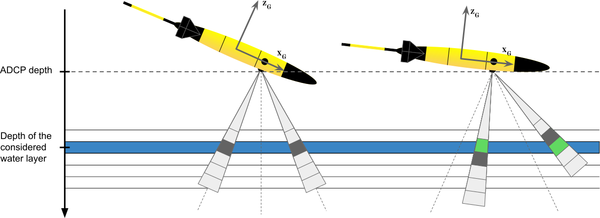
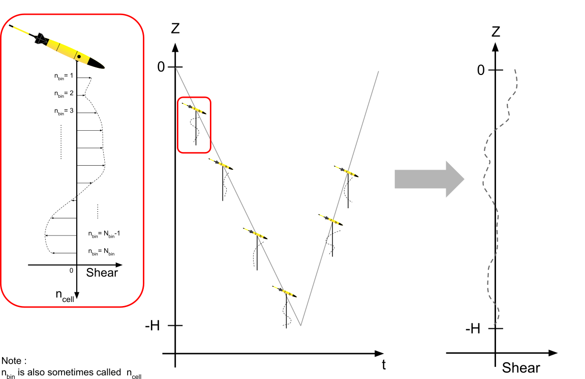

gliderad2cp: Processing ad2cp data from gliders
=================================================

``gliderad2cp`` gliderad2cp processes data from the Nortek AD2CP acoustic doppler current profiler (ADCP) mounted on a glider. gliderad2cp takes data from the ADCP unit and the glider and combines them to produce estimates of vertical shear of velocity. It also prodives functionality to integrate these velocity shear profiles into absolute earth relative water vlocities.

Package description
=======================

gliderad2cp estimates absolute ocean currents from glider ADCP data in 7 steps, each of which can be run independently and controlled via a dictionary of settings.

1. Clean the ADCP data, remove bad measurements and perform a compass calibration.
2. Correct the vertical alignment (in the earth frame of reference) of velocity measurements across all beams (Fig. \autoref{fig:regridding}).
3. Convert the velocity data from ADCP-relative (ie. beam direction; Fig. \autoref{fig:beam2xyz}), to glider-relative (ie. X, Y, Z) and finally to earth-relative velocities (ie. East, North, Up).
4. Calculate the vertical gradient in earth-relative velocities, also known as vertical shear.
5. Reconstruct full-depth profiles of vertical shear from the successive low-range measurements to small scale relative changes in ocean currents, but lacking an absolute reference.
6. Determine the mean ocean current over the period of the glider dive by comparing ADCP-derived glider speed through water to its GPS-derived speed over land, the difference being caused by ocean currents.
7. Reference the full high-resolution vertical shear profile using the glider's dive-averaged current to provide a high-resolution absolute measurements of ocean currents.

1. Cleaning and quality control
--------------------------------

``process_adcp.remove_outliers(ADCP, options)``

The ADCP supplies observed relative velocities from an ensemble of pings. As well as the relative velocity, these ensembles
have the amplitude response and inter-ping correlation. These velocities, amplitudes and correlations are used to quality control the input data.
Using default settings, velocity estimates are discarded if they meet any of the following criteria:

- Velocity > 0.6 m/s

- Amplitude < 75 dB

- Correlation < 70 %

These settings can be changed using the `options` dictionary.

Additionally the first X bins can be discarded at this stage if the operator has observed side-lobe interference.

2. Regridding to avoid shear smearing
-------------------------------------

``process_adcp.remapADCPdepth(ADCP, options)``

Shear smearing

The Nortek AD2CP measurements are time-gated at the same intervals for each individual beam, meaning that the relation between echo delay and measurement range is the same for all 4 beams and does not account for the more open front and back beam angles. The purpose is to have 3 beams at equal angles from vertical when the glider is diving at the correct angle (17.4$$^\circ$$ from horizontal for the Nortek AD2CP; in grey on the left). If the glider is flying at a different angle, there will be a mismatch in depth between the 3 beams (in gray on the right) which requires regridding and use of different bins (in green on the right) to minimise shear smearing.

3. Coordinate transformations
----------------------------------

``process_adcp.calcXYZfrom3beam(ADCP, options)``

To convert from beam coordinates (where each velocity is an along-beam velocity for the four beams), we use the
standard Nortek matrices. This returns velocities in XYZ coordinates, that is, relative to the glider.

``process_adcp.calcENUXYZ(ADCP, options)``

To convert these XYZ coordinates to earth relative velocities (east, north up or ENU) we use the glider compass.
Standard matrices for the Nortek AD2CP.

4. Calculate vertical velocity shear
-------------------------------------

``process_adcp.grid_shear_data(ADCP, data, options)``

Vertical shear of horizontal velocities is calculated by gridded the ENU relative velocities into vertical bins. These vertical velocities of shear can then be integrated into velocity profiles.

5. Integrate shear to velocity
-------------------------------------

``process_adcp.grid_shear_data(ADCP, data, options)``

Profiles of velocity shear are integrated vertically to render vertical profiles of velocity using the lADP method. These vertical velocity profiles are relative and must be referenced to an absolute velocity

6. Obtain reference velocities
-------------------------------------

Several methods can be used to obtain a velocity reference for the shear profiles. Oneis to determine mean ocean current

`process_adcp.get_DAC(ADCP, data, options)`

One source of absolute velocity estimate is the glider dive average current (DAC). Estimation of DAC depends on a flight model for the glider.
Using this flight model, one can calculate the expected surfacing location of a glider from a known start position. The difference between this position
and the actual surfacing location of the glider is caused by ocean currents, so the vertically averaged horizontal velocity can be estimated.

Alternative sources of reference velocities:

- Built in DVL approach to calculate DAC and reference

- Using glider flight model

- Using fixed point reference

- Using bottom tracking

- Visbeck LSQ approach to multiple constraints

7. Reference velocity profiles to mean current
-----------------------------------------------
``process_adcp.reference_shear(ADCP, data, dE,dN,dT, xaxis, yaxis, taxis, options)``

The dive average current calculated in step 6. is used to reference the relative velocity profiles calculated in step 5. thus calculating earth relative absolute current velocities.

Usage
=======

Assessing shear data quality
-----------------------------

- Example code

- Figure list and description

Obtaining referenced velocities
--------------------------------

Known issues
---------------

- Shear bias

- Compass calibrations

.. toctree::
   :maxdepth: 3
   :caption: Contents:

Indices and tables
==================

* :ref:`genindex`
* :ref:`modindex`
* :ref:`search`
