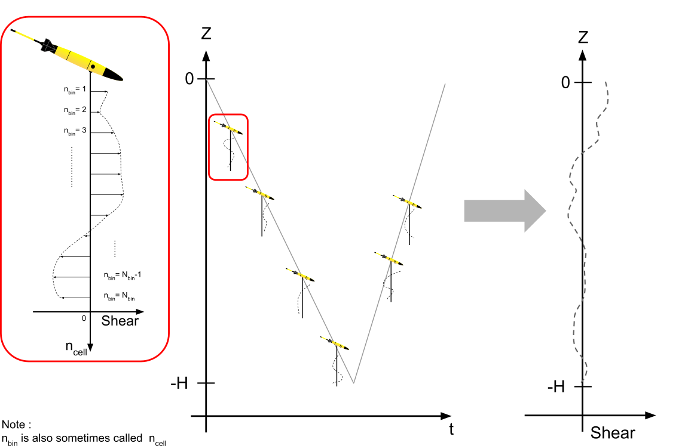

Suggested reviewers: Laur Ferris, AnthonyBosse, Clark Richards

# Summary

Oceanographers routinely measure ocean currents to understand and map the transport of ocean properties. Measuring currents is most commonly done using instruments called acoustic doppler current profilers (ADCPs). These instruments emit shorts pings of sound and listen for the echoing soundwaves which bounce off of water molecules and suspended particles. The delay between emission and reception tells us distance to the particles, and the pitch change of the echo tells us the relative velocity of the particles to the sensor. Using beams of sound in multiple directions, the ADCP can determine 3-dimensional currents at range. ADCPs are however limited by power and size; there is a direct trade-off between size, power and transducer capability. There is a also a trade-off between ping frequency and effective range before the sound wave is attenuated. Large ocean going vessels can carry large, energy hungry, low-frequency ADCPs with ranges of hundreds of meters down into the water column, while smaller platforms must compromise on range and signal to noise ratios.

Ocean gliders are small, low power, autonomous underwater vehicles which profile up and down in the water column, collecting measurements of ocean properties throughout. Ocean gliders now have the ability to carry small ADCPs such as the Nortek Glider AD2CP, with 4 beams and a frequency of 1MHz. The high frequency means that the sensor can only measure currents up to approximately 15 m away from the glider; however as the glider travels up and down through the water column, coverage is possible down to the glider's full depth (typically 1000 m). The key difficulty arises as the ADCP measures ocean currents relative to the glider, rather than relative to ground. As the glider's velocity is often more than an order of magnitude greater than ocean current velocities, a different form of processing is required. We combine shear measurements (how ocean currents change in the vertical over small scales) from multiple successive short velocity profiles to build a full water-column shear profile. We then vertically integrate and reference the shear profile to obtain an absolute velocity profile. This is known as the lowered ADCP method (Fig. \autoref{fig:ladcp}). 

![The Nortek AD2CP measurements are time-gated at the same intervals for each individual beam, meaning that the relation between echo delay and measurement range is the same for all 4 beams and does not account for the more open front and back beam angles. The purpose is to have 3 beams at equal angles from vertical when the glider is diving at the correct angle (17.4$^\circ$ from horizontal for the Nortek AD2CP; in grey on the left). If the glider is flying at a different angle, there will be a mismatch in depth between the 3 beams (in gray on the right) which requires regridding and use of different bins (in green on the right) to minimise shear smearing.\label{fig:regridding}](paper_figures/regridding.png)

This toolbox collects successive measurements of ocean currents as the glider profiles up and down and performs the following steps, providing figures for easy assessment of processing quality:
1. Clean the ADCP data, remove bad measurements and perform a compass calibration.
2. Correct the vertical alignment (in the earth frame of reference) of velocity measurements across all beams (Fig. \autoref{fig:regridding}).
3. Convert the velocity data from ADCP-relative (*ie*. beam direction; Fig. \autoref{fig:beam2xyz}), to glider-relative (*ie*. X, Y, Z) and finally to earth-relative velocities (*ie*. East, North, Up).
4. Calculate the vertical gradient in earth-relative velocities, also known as vertical shear.
5. Reconstruct full-depth profiles of vertical shear from the successive low-range measurements to small scale relative changes in ocean currents, but lacking an absolute reference.
6. Determine the mean ocean current over the period of the glider dive by comparing ADCP-derived glider speed through water to its GPS-derived speed over land, the difference being caused by ocean currents.
7. Reference the full high-resolution vertical shear profile using the glider's dive-averaged current to provide a high-resolution absolute measurements of ocean currents [@visbeck:2002].
8. Perform a shear-bias correction where possible [@todd:2017].

# Statement of need

Software for processing ADCP data exists, with tools provided by instrument manufacturers, private companies and open-source communities. However, none of are developed to be cross-glider compatible. Individual toolboxes for specific gliders or linked to published papers are available, the most mature of which have been developed for Slocum gliders [@gradone:2022, @thurnherr:2015], offering similar functionality although missing specific corrections such as shear bias corrections as per Todd et al. [-@todd:2017].

The glider-ad2cp toolbox greatly simplifies file handling, integration of any glider data to ADCP data, and the complex trigonometry necessary to obtain high quality shear data. In particular, the integration of the Nortek AD2CP varies across glider manufacturers, either using alternating 3-beam configurations between up and down profiles (on the Seaglider or the Spray) or using 4 beams at all times (on the SeaExplorer). This python package allows users to easily load Nortek AD2CP netCDF files and pull the raw data to provide clean shear estimates with consistent processing and quality control independent of which glider they use. Finally, it provides a final referenced velocity profile and corrects for shear bias when the data permits.

# Acknowledgements

BYQ and EF are supported by ONR GLOBAL Grant N62909-21-1-2008 and Formas Grant 2022-01536. BYQ is supported by the Voice of the Ocean Foundation and by the European Union's Horizon 2020 research and innovation programme under Grant 951842 (GROOM II). The authors want to thank the technicians and pilots of Voice of the Ocean foundation for assistance and support during deployments and piloting during 2021 and 2022. Figures are adapted from work performed by Johan Verquier and Émile Moncanis during their final study project of the École Navale hosted at the University of Gothenburg.

# References
